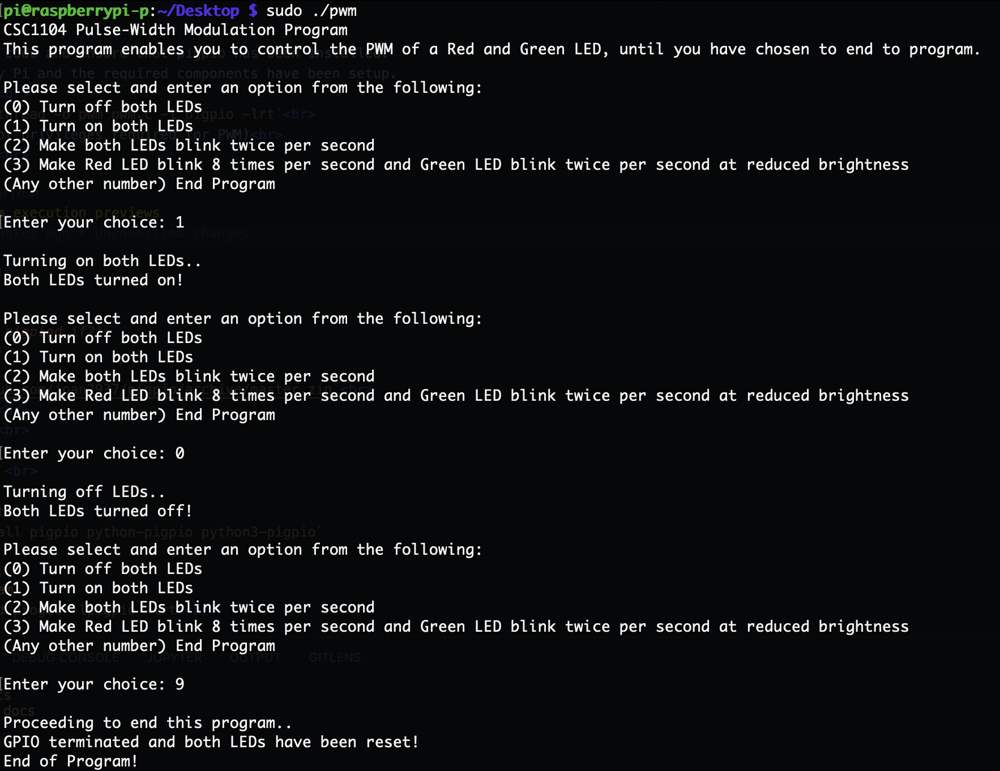
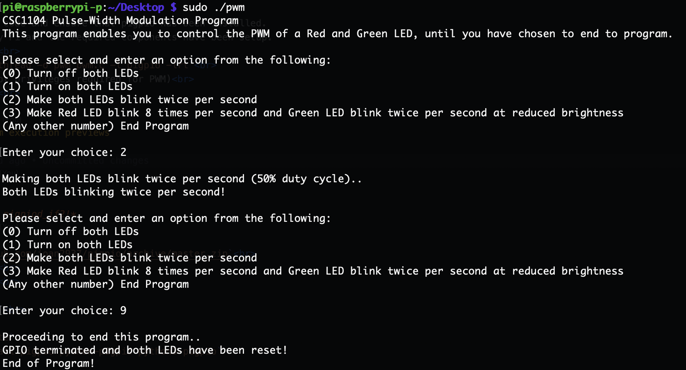
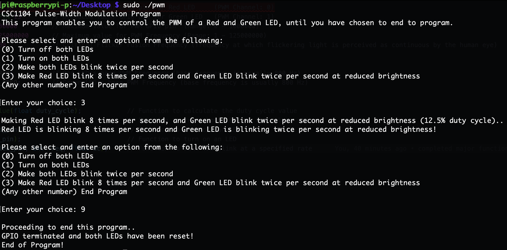
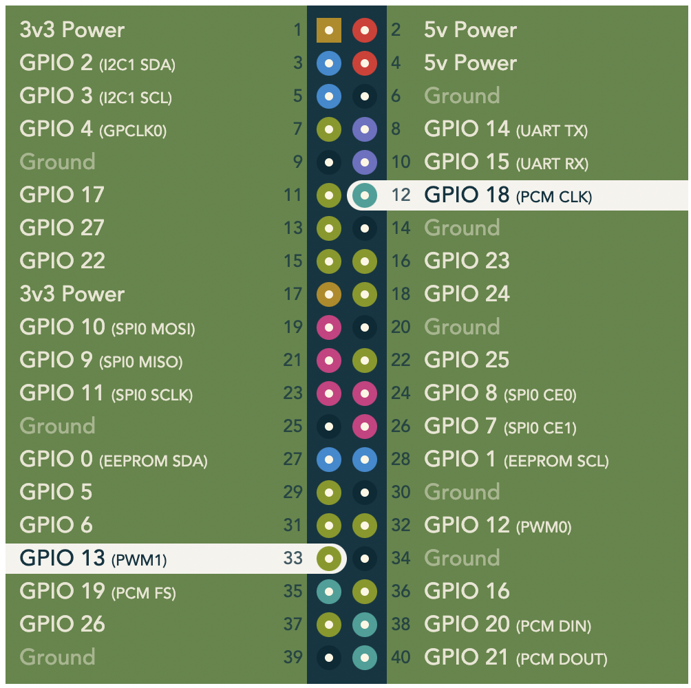

## Pulse-Width Modulation Program
---
### Usage
---
1. Download source code and and ensure that pigpio has been [installed](#pigpio-c-library) into the Raspberry Pi.
2. Ensure that the Raspberry Pi and its required components have been [set up](#raspberry-pi-setup) correctly.
3. Compile the Pulse-Width Modulation program. 
    ` gcc -Wall -pthread -o pwm pwm.c -l pigpio -lrt`  
    *Flags: 
    -Wall : Enable all compiler warning messages 
    -pthread : Add support for multithreading with the pthreads library. This option sets the flags for both the preprocessor and linker.  
    -o : Used to specify the output file name 
    -l <library> : Link to specified library  
    -lrt : Link in real time  *
4. Run/execute the Pulse-Width Modulation program (root privileges are required to run the program!) 
    `sudo ./pwm `  

#### Sample program execution previews
---
Turning both LEDs on and off
 
Making both LEDs blink twice per second
 
Making the Red LED blink 8 times per second and the Green LED blink twice per second, at reduced brightness

### Raspberry Pi Setup
---
#### Components Required
- 1 x Raspberry Pi Model 3B
- 1 x Breadboard
- 1 x Red LED and 1 x Green LED
- 2 x 10K Ω Resistors

#### Setup
- Place both LEDs onto the breadboard and connect the Red LED's anode (longer, positive end) to BCM GPIO pin 18, which is the Raspberry Pi's PWM pin (Channel 0). Connect the Green LED's anode (longer, positive end) to BCM GPIO pin 13, which is the Raspberry Pi's PWM pin (Channel 1).
    - The two PWM GPIO pins to be connected are highlighted below:
    
- Connect a resistor to each LED's cathode (shorter, negative end), and connect the other end of each resistor to any ground pin on the Raspberry Pi. Both LEDs are connected to a resistor in order to limit the current that passes through each LED (to prevent excess current that can burn out the LEDs).
- The Fritzing Diagram of the setup is as follows:
    
- The physical setup of the Raspberry Pi and its components should look something like this:
    

### pigpio C library
---
*Please note that we are using pigpio, and not pigpiod_if2, which is another separate version of the library!*
#### Installation
Preferred Method (using apt package installer):
1. `sudo apt-get update` 
2. `sudo apt-get install pigpio python-pigpio python3-pigpio`  
Alternative Method (download library from Github):
1. `wget https://github.com/joan2937/pigpio/archive/master.zip` 
2. `unzip master.zip` 
3. `cd pigpio-master` 
4. `make` 
5. `sudo make install` 